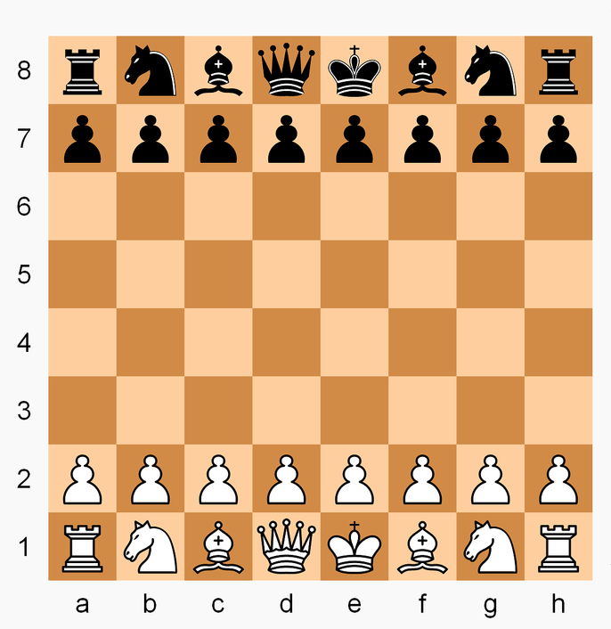

# portfolio-project

**Remember that this project cannot be submitted late.**

Create a class called **ChessVar** to implement an abstract board game based on a chess variant known as "King Of The Hills". The following rule explanation assumes you have some knowledge of standard chess rules, particularly regarding how the pieces move and capture. If you're unsure about any of these rules, feel free to reach out with questions.

The game starts with the standard chess setup. You'll need to track which player's turn it is, with **white always moving first**. Pieces move and capture the same way as in standard chess, but there are **no checks, checkmates, castling, en passant, or pawn promotion**. Players are not informed if their king is in check, and both staying in check or moving into check are legal moves, though they may result in the king being captured and losing the game. The objective is not to checkmate the king but to **capture** it. You can also win the game by **bringing your king to one of the four central squares of the board**. That means the game ends when a player's king is captured and that player loses, or when one player's king moves to one of the four central squares(d4, e4, d5, and e5) and that player wins. Like in standard chess, pawns can move two spaces forward on their first move, but only one space on subsequent moves. 

Locations on the board will be specified using "algebraic notation", with columns labeled a-h and rows labeled 1-8, as shown in this diagram: 

Your ChessVar class must include the following:
* An **init method** that initializes any data members
* A method called **get_game_state** that just returns 'UNFINISHED', 'WHITE_WON', or 'BLACK_WON'. 
* A method called **get_board** that just returns the board. 
* A method called **make_move** that takes two parameters - strings that represent the square moved from and the square moved to.  For example, make_move('b2', 'b4').  If the square being moved from does not contain a piece belonging to the player whose turn it is, or if the indicated move is not legal, or if the game has already been ended, then it should **just return False**.  Otherwise it should make the indicated move, remove any captured piece, update the game state if necessary, update whose turn it is, and return True.

For auto-testing purposes, the initial board will be represented as a nested list structured like this: 
```
[ ['r', 'n', 'b', 'q', 'k', 'b', 'n', 'r'], 
  ['p', 'p', 'p', 'p', 'p', 'p', 'p', 'p'], 
  [' ', ' ', ' ', ' ', ' ', ' ', ' ', ' '], 
  [' ', ' ', ' ', ' ', ' ', ' ', ' ', ' '], 
  [' ', ' ', ' ', ' ', ' ', ' ', ' ', ' '], 
  [' ', ' ', ' ', ' ', ' ', ' ', ' ', ' '], 
  ['P', 'P', 'P', 'P', 'P', 'P', 'P', 'P'], 
  ['R', 'N', 'B', 'Q', 'K', 'B', 'N', 'R'] ]
```

In this setup, lowercase letters represent black pieces, uppercase letters represent white pieces, and empty spaces are shown as ' '. If you align the sub-lists, it will represent the board with pieces at their positions right away. 

Feel free to add whatever other classes, methods, or data members you want.  All data members of a class must be private.  Every class should have an init method that initializes all of the data members for that class.

Here's a very simple example of how the class could be used:
```
game = ChessVar()
print(game.make_move('d2', 'd4'))
print(game.make_move('g7', 'g5'))
print(game.make_move('c1', 'g5'))
print(game.make_move('e7', 'e6'))
print(game.make_move('g5', 'd8'))
print(game.get_board())
```
The output would be:
```
True
True
True
True
True
[
 ['r', 'n', 'b', 'B', 'k', 'b', 'n', 'r'], 
 ['p', 'p', 'p', 'p', ' ', 'p', ' ', 'p'], 
 [' ', ' ', ' ', ' ', 'p', ' ', ' ', ' '], 
 [' ', ' ', ' ', ' ', ' ', ' ', ' ', ' '], 
 [' ', ' ', ' ', 'P', ' ', ' ', ' ', ' '], 
 [' ', ' ', ' ', ' ', ' ', ' ', ' ', ' '], 
 ['P', 'P', 'P', ' ', 'P', 'P', 'P', 'P'], 
 ['R', 'N', ' ', 'Q', 'K', 'B', 'N', 'R']
]

```

The file must be named: **ChessVar.py**


How to Start: If you are not familiar with chess, please take a look at the Wikipedia page[(https://en.wikipedia.org/wiki/Chess)](https://en.wikipedia.org/wiki/Chess), especially focusing on how each type of piece moves on the board. Then, grab a piece of paper and draw a board on it. Mark each space with notations and label them with their respective index in the list. For instance, position ‘a8’ corresponds to index [0][0], ‘b8’ to [0][1], … ‘a7’ to [1][0], … and ‘h1’ to [7][7].

Things to Think About: This project is an excellent opportunity to use inheritance, though it’s not strictly required here. 
We require the board to be returned as a nested list, but you’re welcome to design your own board structure with additional information as needed. Just make sure to output the required board format for auto-testing purpose.


